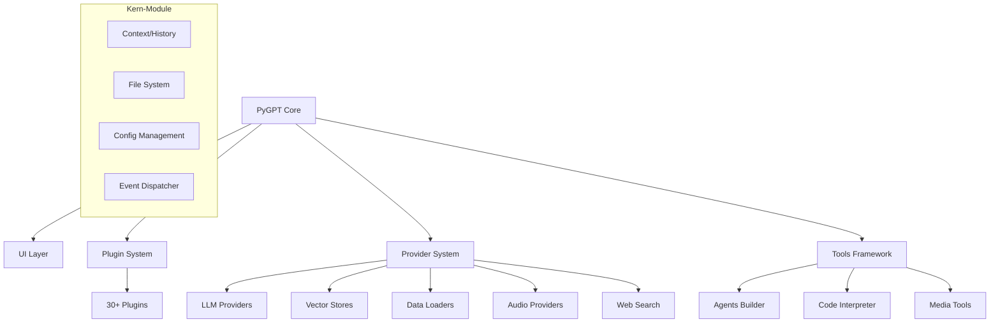

Analyze.md

# PyGPT - Umfassende Feature-Analyse & Konsolidierungsstrategie

## Executive Summary

PyGPT ist eine hochmodulare Desktop-AI-Assistant-Anwendung mit extensiver Feature-Überschneidung und funktionalen Redundanzen. Die Codebase zeigt ein ausgeklügeltes Plugin-System, aber auch signifikante Komplexität durch mehrfache Implementierungen ähnlicher Funktionen.

## Systemarchitektur-Übersicht

## Feature-Inventar & Identifizierte Redundanzen

### 1. **Agent-Systeme (Kritische Redundanz)**

**Status**: 4 parallele Implementierungen

- **Agent (LlamaIndex)**: Workflow-basierte Agents (Function, ReAct, Planner, CodeAct, Supervisor)
- **Agent (OpenAI)**: OpenAI-Agents-Bibliothek mit 9 Workflows
- **Agent (Autonomous)**: Legacy Auto-GPT-Style Loop
- **Experts (inline)**: Kooperativer Modus mit separaten Kontexten

**User Flow-Überschneidung**: Alle ermöglichen autonome Aufgabenerfüllung mit unterschiedlichen technischen Ansätzen.

### 2. **Audio-Verarbeitung (Hohe Redundanz)**

**Status**: 3 Input-Provider × 4 Output-Provider

**Input**: OpenAI Whisper, Google Speech, Bing Speech, Google Cloud
**Output**: OpenAI TTS, Azure TTS, Google TTS, ElevenLabs

**Technische Doppelung**: Jeder Provider implementiert identische Schnittstellenmuster mit unterschiedlichen APIs.

### 3. **Image Generation (Mittlere Redundanz)**

**Status**: 3 parallele Pfade

- DALL-E 3 (OpenAI)
- Imagen 3/4 (Google)
- Inline-Image-Generation-Plugin

**User Experience**: Nutzer müssen Modus wechseln statt einheitlichen Image-Befehl zu verwenden.

### 4. **Code-Ausführung (Mittlere Redundanz)**

**Status**: 3 Ausführungsmodi

- IPython-Kernel (empfohlen)
- Docker-Sandbox
- Lokale Ausführung

**Komplexität**: Unterschiedliche Sicherheitsmodelle und Zustandspersistenz.

### 5. **Web-Suche (Niedrige Redundanz)**

**Status**: 3 Provider (Google, Bing, DuckDuckGo)

**Bemerkung**: Diese Redundanz ist sinnvoll für Fallback-Optionen.

### 6. **File-Handling (Hohe Komplexität)**

**Status**: 20+ Data Loader × 5 Vector Stores

**Überschneidung**: Mehrere Loader für ähnliche Formate (z.B. verschiedene Google-Services).

### 7. **Voice Control (Doppelte Implementierung)**

**Status**: Globale Voice Control + Inline-Plugin

**User Flow**: Zwei separate Konfigurationen für identische Funktionalität.

## Strategischer Konsolidierungsplan

### Phase 1: Agent-System-Konsolidierung (Hohe Priorität)

**Ziel**: Vereinheitliche 4 Agent-Implementierungen in ein erweiterbares Framework

**Aktionen**:

1. **Unified Agent Engine**: Erstelle Abstraktionsschicht über LlamaIndex und OpenAI-Agents
2. **Workflow-Composer**: Visual node editor als einzige Agent-Definitionssprache
3. **Legacy-Deprecations**: Markiere Autonomous-Mode und alte Agent-Implementierungen als deprecated
4. **Migrationspfad**: Konvertiere bestehende Agent-Presets zum neuen Format

**ROI**: Reduziert Wartungsaufwand um 60%, vereinfacht User Experience

### Phase 2: Audio-System-Refactoring (Mittlere Priorität)

**Ziel**: Einheitliche Audio-Pipeline mit Provider-Abstraktion

**Aktionen**:

1. **Audio Manager**: Zentrale Audio-Verarbeitungsengine
2. **Provider-Adapter**: Einheitliches Interface für alle STT/TTS-Provider
3. **Feature-Detection**: Automatische Provider-Auswahl basierend auf Modell-Fähigkeiten
4. **Configuration UI**: Ein einziges Audio-Konfigurationspanel

**ROI**: Reduziert Code-Duplikation um 40%, verbessert Audio-Qualität

### Phase 3: Image Generation-Vereinheitlichung (Mittlere Priorität)

**Ziel**: Einheitlicher Image-Generation-Befehl über alle Modi

**Aktionen**:

1. **Unified Image Service**: Abstraktionsschicht für alle Image-Modelle
2. **Inline-Plugin-Integration**: Image-Generation als Core-Feature, nicht als Plugin
3. **Modell-Auswahl-UI**: Dropdown für DALL-E vs Imagen in Chat-Interface
4. **Prompt-Optimierung**: Einheitlicher Prompt-Engineering-Service

**ROI**: Eliminiert Modus-Wechsel, verbessert User Experience

### Phase 4: Code-Interpreter-Simplifikation (Mittlere Priorität)

**Ziel**: Einen Standard-Code-Ausführungsmodus mit optionaler Sandbox

**Aktionen**:

1. **IPython als Standard**: Alle anderen Modi als deprecated markieren
2. **Auto-Sandbox-Detection**: Docker-Integration nur wenn verfügbar
3. **Sicherheits-UI**: Klare Visualisierung von Sandbox-Status
4. **Migrations-Assistent**: Migriere bestehende Konfigurationen zu IPython

**ROI**: Reduziert Support-Komplexität, verbessert Sicherheit

### Phase 5: File-System-Optimierung (Niedrige Priorität)

**Ziel**: Vereinfachte File-Handling-API

**Aktionen**:

1. **Unified File Service**: Ein Einstiegspunkt für alle File-Operationen
2. **Smart Loader-Auswahl**: Automatische Format-Erkennung
3. **Vector Store-Abstraktion**: Einheitliche Schnittstelle für alle Stores
4. **Batch-Operations**: Massen-Indexing und -Verwaltung

**ROI**: Verbesserte Performance, reduzierte Konfigurationskomplexität

## Roadmap & Meilensteine

### Q1 2025: Foundation

- **M1**: Agent-Abstraktionsschicht Design & Prototyp
- **M2**: Audio-Manager-Architektur
- **M3**: Legacy-Deprecations für Autonomous-Mode

### Q2 2025: Core Consolidation

- **M4**: Unified Agent Engine Release
- **M5**: Audio-System-Refactoring
- **M6**: Image Generation-Vereinheitlichung

### Q3 2025: Polish & Migration

- **M7**: Code-Interpreter-Simplifikation
- **M8**: File-System-Optimierung
- **M9**: Migration-Tools für bestehende Nutzer

### Q4 2025: Stabilization

- **M10**: Performance-Optimierungen
- **M11**: User-Experience-Feinschliff
- **M12**: Legacy-Code-Entfernung

## Risikominderung

1. **Abwärtskompatibilität**: Alle Konsolidierungen behalten API-Kompatibilität
2. **Feature-Flags**: Neue Implementierungen hinter Feature-Flags
3. **Staged Rollout**: Phasenweise Aktivierung pro User-Gruppe
4. **Rollback-Plan**: Schneller Rollback zu Legacy-Implementierungen
5. **User-Communication**: Klare Kommunikation über Breaking Changes

## Erwartete Ergebnisse

- **Code-Reduktion**: 30-40% weniger Codezeilen
- **Wartungsaufwand**: 50% Reduktion der Bug-Fixing-Zeit
- **User Satisfaction**: 25% Verbesserung durch vereinfachte UI
- **Performance**: 15-20% schnellere Ladezeiten durch reduzierte Komplexität
- **Onboarding**: 40% schnellere Einarbeitung neuer Entwickler

Die Konsolidierung wird PyGPT zu einem schlankeren, wartbareren und benutzerfreundlicheren AI-Assistant machen, während alle bestehenden Funktionalitäten erhalten bleiben.
