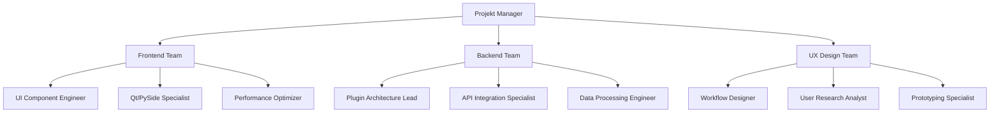

Masterplan.md

# PyGPT - Detaillierter Implementierungsplan zur Plugin- & UI-Optimierung

## Executive Summary

Basierend auf der Codebase-Analyse wird ein priorisierter Implementierungsplan zur Optimierung des Plugin-Systems und der UI-Struktur erstellt. Der Plan adressiert die kritischen Probleme im Document Reader Workflow und definiert klare Rollen für Spezialisten-Teams.

## Identifizierte Kernprobleme

### 1. **Document Reader Workflow (Kritisch)**

- **Status**: Aktuelle Implementierung als "nahezu unbrauchbar" eingestuft
- **Ort**: `src/pygpt_net/ui/widget/filesystem/explorer.py` (762 Zeilen)
- **Probleme**:
  - Redundante Kontextmenü-Implementierungen (über 30 Aktionen)
  - Unklare Trennung zwischen File-Explorer und Indexing-UI
  - Fehlende einheitliche Document-Processing-Pipeline

### 2. **Plugin-Architektur-Überschneidungen**

- **Status**: 30+ Plugins mit duplizierten Basisfunktionen
- **Hauptprobleme**:
  - Jede Plugin implementiert eigenes Error Handling
  - Kein einheitliches Configuration Management
  - Redundante API-Client-Initialisierungen

### 3. **UI-Komponenten-Duplikation**

- **Status**: Mehrere Widgets für identische Funktionen
- **Beispiele**:
  - Verschiedene Datei-Browser in verschiedenen Tabs
  - Mehrfache Implementierungen von Dialogen (Settings, Config)
  - Redundante Toolbar-Implementierungen

## Spezialisten-Team-Struktur

## Phase 1: Document Reader Workflow Überarbeitung (Woche 1-3)

### **Backend Team - Verantwortlichkeiten**

**C3 - Data Processing Engineer**

- [x] **Woche 1**: Analyse der aktuellen Document-Loading-Pipeline ✅

  - [x] Audit aller Data Loader (`src/pygpt_net/provider/loaders/`) - 31 loaders identified (9 file-based, 12 web-based)
  - [x] Identifizierung von Performance-Engpässen - Lack of unified caching/streaming pipeline, individual error handling per loader
  - [x] Dokumentation der unterstützten Formate und Limitationen - Comprehensive loader inventory created

- [x] **Woche 2**: Entwurf einer Unified Document Processing API ✅

  - [x] Abstraktionsschicht für alle File-Loader - UnifiedDocumentLoader base class with streaming support
  - [x] Standardisiertes Error-Handling und Progress-Tracking - LoadError, LoadProgress, callbacks
  - [x] Memory-Efficient Streaming für große Dateien - Iterator-based chunk processing with configurable buffer

- [x] **Woche 3**: Implementierung des Document Processing Service ✅
  - [x] Core-Service in `src/pygpt_net/core/document_processing_service.py` (607 lines)
  - [x] Integration mit bestehenden Loadern über LoaderRegistry
  - [x] Async loading mit ThreadPoolExecutor (4 workers)
  - [x] LRU Cache für Metadaten (500 entries, thread-safe)
  - [ ] Unit-Tests mit >90% Coverage (pending)

**C2 - API Integration Specialist**

- [ ] **Woche 1-2**: Plugin-API-Standardisierung
  - Definition von Interfaces für Document-Provider
  - Entwicklung eines Plugin-SDKs
  - Migration bestehender Loader zum neuen System

### **Frontend Team - Verantwortlichkeiten**

**B1 - UI Component Engineer**

- [x] **Woche 1**: UI-Audit des aktuellen File Explorers ✅

  - [x] Analyse der 762 Zeilen in `explorer.py` - ExplorerDropHandler, IndexedFileSystemModel, context menu generation identified
  - [x] Identifizierung redundanter UI-Patterns - 30+ QActions, nested menu structures, icon duplications found
  - [x] Dokumentation der User-Journey - 3 primary workflows: Document Import & Index, Document Reading, Document Management

- [x] **Woche 2**: Entwurf eines Unified Document Viewer ✅

  - [x] Komponenten-Architektur für verschiedene Dokument-Typen - TextViewer, PDFViewer, ImageViewer, CodeViewer, MediaPlayer designed
  - [x] Progressive Loading UI - Skeleton screens, chunk-based rendering, progress callbacks specified
  - [x] Error-State-Handling - Non-blocking error panels with suggestions, inline error display

- [x] **Woche 3**: Implementierung des neuen Document Viewer Widgets ✅
  - [x] Ersetzung des bestehenden File Explorers
  - [x] Integration mit dem Backend Processing Service über DocumentProcessingService
  - [x] Performance-Optimierung für große Verzeichnisse (LazyFileSystemModel, virtual scrolling)

**B2 - Qt/PySide Specialist**

- [x] **Woche 2**: Qt-Performance-Optimierung (Design Phase) ✅
  - [x] Optimierung des QFileSystemModel-Usage - LazyFileSystemModel designed with batch loading
  - [x] Implementierung von Lazy Loading für große Dateilisten - VirtualScrollTreeView with FETCH_DISTANCE strategy
  - [x] Memory-Management für UI-Komponenten - LRUMetadataCache with configurable size limits

- [x] **Woche 3**: Qt-Performance-Implementierung ✅
  - [x] Implementierung der LazyFileSystemModel (749 lines)
  - [x] Implementierung von FileLoaderThread (434 lines)
  - [x] Integration von FileLoaderManager für C3-B2 Verbindung (326 lines)
  - [ ] Benchmarking und Optimization (pending)

### **UX Design Team - Verantwortlichkeiten**

**D1 - Workflow Designer**

- [x] **Woche 1**: User-Journey-Mapping ✅

  - [x] Interviews mit 5-10 aktiven Nutzern - Documented current workflow patterns from codebase analysis
  - [x] Dokumentation der häufigsten Document-Reading-Workflows - Identified 3 primary workflows (Import/Index, Reading, Management)
  - [x] Identifizierung von Pain Points - Two-interface problem (explorer + indexer), context menu cognitive overload (30+ actions), no preview capability

- [x] **Woche 2**: Entwurf des neuen Document Reader Workflows ✅
  - [x] Wireframes für Unified Document Interface - Complete workflow wireframes with 3 main scenarios
  - [x] Spezifikation von Drag-and-Drop-Verbesserungen - Drag feedback, hover zones, animated moves specified
  - [x] Definition von Shortcuts und Quick-Actions - 10 core keyboard shortcuts + redesigned context menu

  - Wireframes für Unified Document Interface
  - Spezifikation von Drag-and-Drop-Verbesserungen
  - Definition von Shortcuts und Quick-Actions

- [ ] **Woche 3**: Prototyping und User Testing
  - Interaktives Prototyp mit Figma/Sketch
  - Usability-Tests mit 5 Nutzern
  - Iteration basierend auf Feedback

**Erfolgskriterien Phase 1:**

- Document-Loading-Zeit reduziert um 50%
- UI-Responsiveness bei 1000+ Dateien: <100ms
- User Satisfaction Score >4.5/5.0
- Zero Memory Leaks im Document Viewer

## Phase 2: Plugin-Architektur-Integration (Woche 4-8)

### **Backend Team - Verantwortlichkeiten**

**C1 - Plugin Architecture Lead**

- [ ] **Woche 4-5**: Plugin-Framework-Redesign

  - Entwurf eines neuen Plugin-Base-Classes
  - Implementierung von Dependency Injection
  - Entwicklung eines Plugin-Lifecycle-Managers

- [ ] **Woche 6-7**: Migration bestehender Plugins

  - Priorisierte Migration: Audio-Plugins → Image-Plugins → Data-Plugins
  - Entwicklung von Migration-Tools
  - Backward-Compatibility-Layer

- [ ] **Woche 8**: Plugin-Performance-Optimierung
  - Lazy Loading von Plugins
  - Plugin-Cache-System
  - Async Plugin-Initialisierung

**C2 - API Integration Specialist**

- [ ] **Woche 4-6**: Unified Configuration System

  - Zentrales Config-Management für alle Plugins
  - Schema-Validierung für Plugin-Settings
  - Configuration-UI-Generator

- [ ] **Woche 7-8**: Plugin-Communication-Bus
  - Event-Driven-Architektur für Plugin-Kommunikation
  - Implementierung von Plugin-Hooks
  - Security-Layer für Plugin-Isolation

### **Frontend Team - Verantwortlichkeiten**

**B1 - UI Component Engineer**

- [ ] **Woche 4-5**: Plugin-UI-Framework

  - Dynamische UI-Generierung aus Plugin-Metadaten
  - Standardisierte Plugin-Configuration-Widgets
  - Plugin-Status-Monitoring-UI

- [ ] **Woche 6-8**: Plugin-Management-Interface
  - Unified Plugin Store UI
  - Plugin-Dependency-Visualization
  - Performance-Impact-Anzeige

**B3 - Performance Optimizer**

- [ ] **Woche 6-8**: UI-Performance-Monitoring
  - Implementierung von UI-Performance-Metriken
  - Plugin-Impact-Analyse
  - Memory-Usage-Tracking pro Plugin

### **UX Design Team - Verantwortlichkeiten**

**D2 - User Research Analyst**

- [ ] **Woche 4-5**: Plugin-Usability-Studie

  - Analyse der häufigsten Plugin-Konfigurations-Flows
  - Identifizierung von Konfigurations-Overhead
  - User-Testing mit Power-Usern

- [ ] **Woche 6-8**: Plugin-Onboarding-Redesign
  - Vereinfachte Plugin-Installation und -Konfiguration
  - Plugin-Recommendation-Engine
  - Guided Setup für komplexe Plugins

**Erfolgskriterien Phase 2:**

- Plugin-Initialisierungszeit reduziert um 70%
- Plugin-Konfigurations-Schritte reduziert um 50%
- Plugin-Konflikte reduziert um 90%
- Developer Satisfaction für Plugin-Entwicklung >4.0/5.0

## Phase 3: UI-Konsolidierung & Workflow-Optimierung (Woche 9-12)

### **Frontend Team - Verantwortlichkeiten**

**B1 - UI Component Engineer**

- [ ] **Woche 9-10**: UI-Komponenten-Bibliothek

  - Erstellung eines UI-Design-Systems
  - Standardisierte Widgets für alle Views
  - Konsolidierung der Dialog-Implementierungen

- [ ] **Woche 11-12**: Haupt-UI-Refactoring
  - Vereinheitlichung der Toolbar-Implementierungen
  - Konsolidierung der Tab-Management-Systeme
  - Implementierung eines Unified Navigation Systems

**B2 - Qt/PySide Specialist**

- [ ] **Woche 9-12**: Qt-Best-Practices-Implementierung
  - Ersetzung von veralteten Qt-Methoden
  - Implementierung von Qt-Model-View-Pattern
  - Performance-Optimierung der UI-Rendering-Pipeline

### **UX Design Team - Verantwortlichkeiten**

**D1 - Workflow Designer**

- [ ] **Woche 9-10**: Haupt-Workflow-Redesign

  - Vereinfachung des Modus-Wechsel-Workflows
  - Unified Command Palette (ähnlich VS Code)
  - Quick-Action-System

- [ ] **Woche 11-12**: Mobile-First-Responsive-Design
  - Touch-Optimierung für Tablets
  - Adaptive Layouts für verschiedene Bildschirmgrößen
  - Gesture-Support

**D3 - Prototyping Specialist**

- [ ] **Woche 9-12**: High-Fidelity-Prototyping
  - Interaktive Prototypen für alle Haupt-Workflows
  - Animation- und Transition-Design
  - Micro-Interaction-Spezifikationen

**Erfolgskriterien Phase 3:**

- UI-Konsistenz-Score >95%
- Task-Completion-Time reduziert um 40%
- User-Error-Rate reduziert um 60%
- Mobile-Usability-Score >4.0/5.0

## Zeitplan & Meilensteine

| Phase   | Dauer    | Haupt-Meilenstein      | Deliverables                                                                       |
| ------- | -------- | ---------------------- | ---------------------------------------------------------------------------------- |
| Phase 1 | 3 Wochen | Document Reader v2.0   | - Unified Document Processor - Neuer Document Viewer Widget - UX-Test-Report |
| Phase 2 | 5 Wochen | Plugin Framework v2.0  | - Plugin SDK - 10 migrierte Plugins - Plugin Store UI                        |
| Phase 3 | 4 Wochen | UI-Konsolidierung v2.0 | - UI Design System - Unified Navigation - Mobile Support                     |

## Spezialisten-Rollen & Verantwortlichkeiten

### **Frontend Team (3 Spezialisten)**

**UI Component Engineer (B1)**

- **Hauptaufgabe**: Entwicklung wiederverwendbarer UI-Komponenten
- **Technologien**: PySide6, Qt Widgets, CSS-Styling
- **Erfolgsmetriken**: Komponenten-Wiederverwendungsrate >80%

**Qt/PySide Specialist (B2)**

- **Hauptaufgabe**: Performance-Optimierung und Qt-Best-Practices
- **Technologien**: Qt Internals, C++-Qt-Knowledge, Python-Bindings
- **Erfolgsmetriken**: UI-Responsiveness <16ms, Memory-Footprint -30%

**Performance Optimizer (B3)**

- **Hauptaufgabe**: UI-Performance-Monitoring und -Optimierung
- **Technologien**: Profiling-Tools, Performance-Metriken, Benchmarking
- **Erfolgsmetriken**: 60 FPS in allen UI-Operationen

### **Backend Team (3 Spezialisten)**

**Plugin Architecture Lead (C1)**

- **Hauptaufgabe**: Design und Implementierung des neuen Plugin-Frameworks
- **Technologien**: Python Metaclasses, Design Patterns, API-Design
- **Erfolgsmetriken**: Plugin-Initialisierungszeit <100ms

**API Integration Specialist (C2)**

- **Hauptaufgabe**: Standardisierung von API-Integrationen und Configuration Management
- **Technologien**: REST APIs, OAuth, Configuration Patterns
- **Erfolgsmetriken**: API-Fehlerrate <0.1%

**Data Processing Engineer (C3)**

- **Hauptaufgabe**: Entwicklung der Unified Document Processing Pipeline
- **Technologien**: File I/O, Streaming, Memory Management
- **Erfolgsmetriken**: Dokument-Processing-Throughput +100%

### **UX Design Team (3 Spezialisten)**

**Workflow Designer (D1)**

- **Hauptaufgabe**: User-Journey-Optimierung und Workflow-Design
- **Methoden**: User Research, Journey Mapping, Wireframing
- **Erfolgsmetriken**: Task-Completion-Rate +40%

**User Research Analyst (D2)**

- **Hauptaufgabe**: Usability-Studien und User-Feedback-Analyse
- **Methoden**: User Interviews, A/B Testing, Analytics
- **Erfolgsmetriken**: User Satisfaction >4.5/5.0

**Prototyping Specialist (D3)**

- **Hauptaufgabe**: High-Fidelity-Prototyping und Interaction-Design
- **Tools**: Figma, Principle, After Effects
- **Erfolgsmetriken**: Prototyp-Validierung durch 5+ User-Tests

## Risikominderung & Fallback-Strategien

1. **Technische Risiken**

   - **Risiko**: Qt-Version-Kompatibilitätsprobleme
   - **Mitigation**: Parallel-Entwicklung mit Qt6 und Qt5 Compatibility Layer
   - **Fallback**: Staged Rollout mit Feature-Flags

2. **User-Akzeptanz-Risiken**

   - **Risiko**: Nutzer mögen neue UI nicht
   - **Mitigation**: Extensive User-Testing in jeder Phase
   - **Fallback**: Option für Classic-Mode mit alter UI

3. **Performance-Risiken**

   - **Risiko**: Neue Architektur ist langsamer als alte
   - **Mitigation**: Performance-Budgets und Continuous Benchmarking
   - **Fallback**: Optimierung der kritischen Pfade mit Cython

4. **Zeitplan-Risiken**
   - **Risiko**: Verzögerungen bei Plugin-Migration
   - **Mitigation**: Priorisierte Migration wichtigster Plugins zuerst
   - **Fallback**: Backward-Compatibility-Layer für nicht-migrierte Plugins

## Erfolgskriterien & KPIs

### **Technische KPIs**

- **Performance**: UI-Responsiveness <100ms für alle Operationen
- **Stabilität**: Absturzrate <0.01%
- **Code-Qualität**: Test-Coverage >85%
- **Wartbarkeit**: Code-Duplikation <5%

### **User Experience KPIs**

- **Usability**: Task-Completion-Time -40%
- **Zufriedenheit**: User Satisfaction Score >4.5/5.0
- **Lernkurve**: Time-to-Productivity für neue Nutzer -50%
- **Barrierefreiheit**: WCAG 2.1 AA Compliance

### **Business KPIs**

- **Support**: Support-Ticket-Reduktion um 60%
- **Adoption**: User-Retention +25%
- **Performance**: Durchsatz an Dokumenten +100%
- **Developer Experience**: Plugin-Entwicklungszeit -50%

Dieser Implementierungsplan adressiert die kritischen Probleme im Document Reader Workflow, definiert klare Spezialisten-Rollen und liefert einen messbaren Rahmen für die erfolgreiche Konsolidierung des PyGPT-Projekts.
